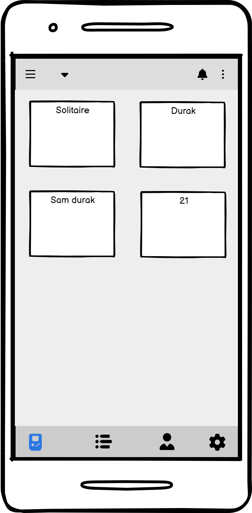
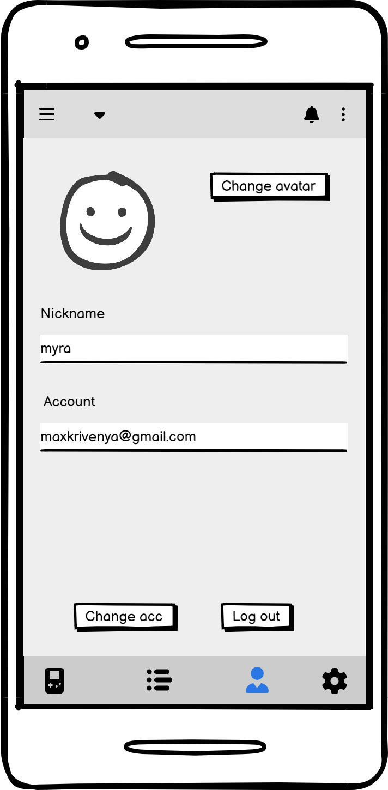
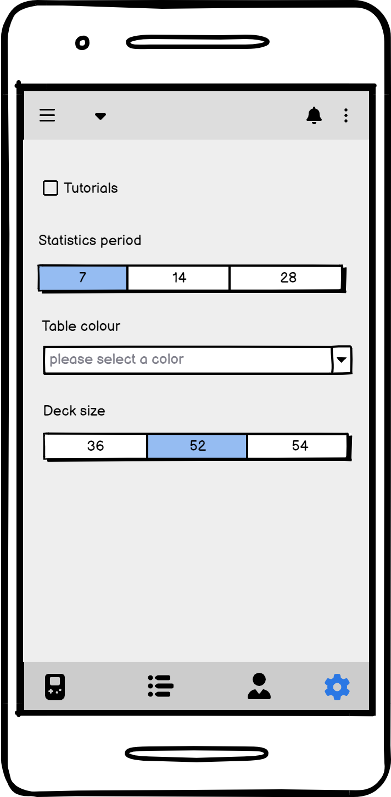

Вот исправленный вариант с правильным форматом:

# Требования к проекту

## 1. Введение
С ростом популярности карточных игр и увеличением числа игроков возникает необходимость в удобном и эффективном мобильном приложении для их организации и проведения. "Карточная Игротека" — это мобильное приложение, разработанное для помощи пользователям в создании и управлении карточными играми, а также в поиске соперников.

Приложение предлагает функционал для создания игровых сессий, поиска игр по различным критериям, а также взаимодействия с другими игроками. "Карточная Игротека" фокусируется на упрощении процесса организации игр и максимальном удобстве использования для игроков всех уровней.

Для любителей карточных игр, от новичков до опытных игроков, "Карточная Игротека" предлагает возможность создания игр, поиска соперников и управления игровыми сессиями. Это приложение отличается от существующих платформ тем, что предлагает специализированные функции для карточных игр, что делает процесс игры более доступным и удобным.

### Границы

| № | Описание                   | Потребности бизнеса (MoSCoW) |
|---|----------------------------|-------------------------------|
| 1 | Регистрация                | Must have                     |
| 2 | Авторизация                | Must have                     |
| 3 | Создание игровых сессий    | Must have                     |
| 4 | Поиск игр по названию      | Must have                     |
| 5 | Поиск соперников           | Must have                     |
| 6 | Чат для игроков            | Should have                   |
| 7 | Информация об играх        | Should have                   |
| 8 | Оценка и отзывы            | Could have                    |

## 2. Требования пользователя

### 2.1 Программные интерфейсы
Платформа "Карточная Игротека" будет взаимодействовать с несколькими внешними системами и сервисами для обеспечения своей функциональности.

Для аутентификации и авторизации пользователей будет использоваться OAuth 2.0, что обеспечит безопасность процессов входа и регистрации. 

### 2.2 Интерфейс пользователя

| Функциональное требование       | Описание                                                                                                                                         |
|---------------------------------|--------------------------------------------------------------------------------------------------------------------------------------------------|
| Регистрация                     | Пользователи смогут зарегистрироваться в отдельном окне.                                                                                       |
| Авторизация                     | Пользователи смогут авторизоваться в отдельном окне.                                                                                           |
| Создание игровых сессий         | Пользователи смогут создавать игровые сессии и настраивать параметры (количество игроков, правила и т.д.).                                      |
| Поиск игр по названию           | Пользователи смогут вводить название игры в текстовое поле. Результаты будут отображаться в списке с краткой информацией.                       |
| Поиск соперников                | Пользователи смогут искать других игроков по различным критериям (уровень, игры, предпочтения).                                                |
| Чат для игроков                 | Возможность общения между игроками в реальном времени во время игровой сессии.                                                                  |
| Информация об играх             | Профили игр будут содержать описание, правила и рейтинги.                                                                                     |
| Оценка и отзывы                 | Пользователи смогут оставлять отзывы и оценки для игр и игровых сессий.                                                                         |

### 2.3 Характеристики пользователей

| Группа пользователей              | Уровень образования                      | Опыт                                                 | Техническая грамотность | Потребности и ожидания                                             |
|-----------------------------------|-----------------------------------------|------------------------------------------------------|-------------------------|-------------------------------------------------------------------|
| Любители карточных игр            | Среднее или высшее                      | Имеют опыт игры в карточные игры, знакомы с правилами. | Средний                 | Ожидают наличие удобного интерфейса, возможности создания игр и поиска соперников. |
| Новички                           | Среднее или высшее                      | Ограниченный опыт; могут быть не знакомы с правилами различных игр. | Низкий/Средний          | Ищут простоту в использовании, интуитивный интерфейс и помощь в обучении. |
| Опытные игроки                   | Высшее или среднее специальное          | Долгий опыт игры, знакомы с множеством игр и стратегий. | Высокий                 | Ожидают расширенных функций, возможности оценки и отзывов, а также общения с другими игроками. |

### 2.4 Предположения и зависимости

**Предположения**:
1. Пользователи имеют доступ к сети Интернет для использования платформы "Карточная Игротека".
2. Пользователи знакомы с основными функциями мобильных приложений и смогут самостоятельно находить и использовать функции "Карточной Игротеки".
3. База данных будет регулярно обновляться новыми играми и пользователями для поддержания активности сообщества.
4. Необходимая техническая инфраструктура обеспечит стабильную работу приложения, включая хостинг и безопасность данных.
5. Будет предоставлена техническая поддержка пользователям для решения возникающих вопросов.

**Зависимости**:
1. Успех "Карточной Игротеки" зависит от эффективной маркетинговой стратегии для привлечения целевой аудитории.
2. Необходимы квалифицированные сотрудники для дальнейшего развития и поддержки платформы.
3. Полноценная работоспособность приложения будет зависеть от успешной интеграции с внешними API для обеспечения актуального контента.
4. Стабильность работы приложения будет зависеть от соблюдения законодательства и правил, что может повлиять на доступность контента.

## 3. Системные требования

### 3.1 Функциональные требования

| Функциональное требование                   | Описание                                                                                                               | Приоритет      |
|---------------------------------------------|------------------------------------------------------------------------------------------------------------------------|----------------|
| Регистрация                                 | Система должна поддерживать регистрацию пользователей.                                                               | Must have      |
| Авторизация                                 | Система должна поддерживать авторизацию пользователей.                                                               | Must have      |
| Создание игровых сессий                     | Система должна позволять пользователям создавать игровые сессии с настройками.                                       | Must have      |
| Поиск игр по названию                       | Система должна позволять пользователям искать игры по названию.                                                      | Must have      |
| Поиск соперников                            | Пользователь может искать других игроков по различным критериям.                                                     | Must have      |
| Чат для игроков                             | Система должна поддерживать возможность общения между игроками во время игры.                                        | Should have    |
| Информация об играх                         | Профили игр должны содержать описание, правила и рейтинги.                                                           | Should have    |
| Оценка и отзывы                            | Пользователи должны иметь возможность оставлять отзывы и оценки для игр.                                             | Could have     |

## Скриншоты

Игры:

Настройки аккаунта:

Настройки приложения:

### 3.2 Нефункциональные требования

- **NFR-1**: Среднее время безотказной работы (MTBF) должно составлять не менее 95,5%.
- **NFR-2**: Должна быть реализована защита данных, включая шифрование и соответствие минимальным стандартам безопасности.
- **NFR-3**: Время отклика на запросы поиска должно составлять не более 2 секунд.
- **NFR-4**: Возможность увеличения серверных мощностей для поддержки роста пользователей без значительных изменений в архитектуре.
- **NFR-5**: Среднее время обучения пользователя должно быть не более 5 минут.
